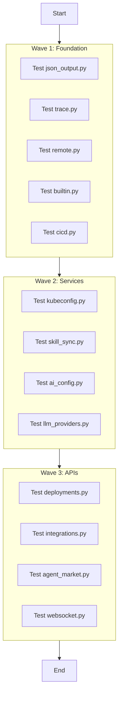

# NexusOps Backend Test Coverage Plan (Target: 80%)

## 1. Analysis & Effort Estimation

| Module | Current Coverage | Lines/Stmts | Complexity | Test Type | Est. Tests | Effort |
|:---|:---:|:---:|:---:|:---:|:---:|:---:|
| `app/services/json_output.py` | 0% | 172 | Medium | Unit | 12 | High |
| `app/api/ai_config.py` | 15% | 201 | Medium | Integration | 8 | Medium |
| `app/api/deployments.py` | 21% | 86 | Low | Integration (DB) | 5 | Low |
| `app/api/integrations.py` | 20% | 234 | Medium | Integration | 6 | Medium |
| `app/api/llm_providers.py` | 21% | 220 | Medium | Integration | 6 | Medium |
| `app/api/kubeconfig.py` | 28% | 195 | Medium | Unit/Integration | 6 | Medium |
| `app/services/cicd.py` | 20% | 253 | Medium | Unit | 5 | Low |
| `app/gateway/executor/remote.py` | 27% | 65 | Low | Unit (Mock) | 5 | Low |
| `app/api/websocket.py` | 27% | 180 | High | Integration (WS) | 6 | High |
| `app/gateway/trace.py` | 36% | 97 | Low | Unit | 3 | Low |
| `app/services/skill_sync.py` | 36% | 180 | Medium | Unit (Mock) | 6 | Medium |
| `app/api/agent_market.py` | 57% | 298 | High | Integration (DB) | 8 | High |
| `app/gateway/executor/builtin.py` | 61% | 139 | Low | Unit | 3 | Low |

**Total Estimated Tests:** ~79 tests

## 2. Parallel Execution Waves

### Wave 1: Foundation & Utilities (Independent)
Focus on pure logic and base classes that don't require complex DB setup or external services.
- `app/services/json_output.py`
- `app/gateway/trace.py`
- `app/gateway/executor/builtin.py`
- `app/gateway/executor/remote.py`
- `app/services/cicd.py`

### Wave 2: Configuration & Services (Mock-heavy)
Focus on services that interact with external APIs or configuration, requiring mocking.
- `app/api/kubeconfig.py`
- `app/services/skill_sync.py`
- `app/api/ai_config.py`
- `app/api/llm_providers.py`

### Wave 3: Complex APIs (DB & WebSocket)
Focus on API endpoints that require database fixtures or WebSocket clients.
- `app/api/deployments.py`
- `app/api/integrations.py`
- `app/api/agent_market.py`
- `app/api/websocket.py`

## 3. Detailed Test Requirements

### Wave 1

#### `app/services/json_output.py`
- **Type**: Unit
- **Key Tests**:
    - `JSONSchemaValidator.validate`: Valid/Invalid schema.
    - `JSONRepair.repair`: Fix broken JSON (quotes, trailing commas).
    - `JSONGenerator.generate`: Mock LLM response, verify retry logic.
    - `OutputFormatter`: Check type conversion.
- **Mocking**: `llm_call` callback.

#### `app/gateway/trace.py`
- **Type**: Unit
- **Key Tests**:
    - `generate_trace_id`: Format check.
    - Context variable propagation (async).

#### `app/gateway/executor/remote.py`
- **Type**: Unit
- **Key Tests**:
    - `execute`: Mock `httpx.AsyncClient`, verify request format.
    - Error handling: Timeout, 500 errors.

#### `app/gateway/executor/builtin.py`
- **Type**: Unit
- **Key Tests**:
    - `BaseAgentHandler`: Abstract methods.
    - `BuiltinExecutor`: Registry and execution flow.

#### `app/services/cicd.py`
- **Type**: Unit
- **Key Tests**:
    - `BuildTrigger`: Validation.
    - `BuildInfo`: Data class behavior.

### Wave 2

#### `app/api/kubeconfig.py`
- **Type**: Unit/Integration
- **Key Tests**:
    - `create_kubeconfig`: Validate YAML format.
    - `validate_connection`: Mock `kubernetes.client`.

#### `app/services/skill_sync.py`
- **Type**: Unit
- **Key Tests**:
    - `parse_skill_md`: Frontmatter parsing.
    - `sync_skill`: Mock `httpx` for GitHub content.

#### `app/api/ai_config.py`
- **Type**: Integration
- **Key Tests**:
    - `get_ai_config`: Return current config.
    - `update_ai_config`: Update provider/model.
    - `test_ai_connection`: Mock provider clients.

#### `app/api/llm_providers.py`
- **Type**: Integration
- **Key Tests**:
    - `list_providers`: Check default providers.
    - `configure_provider`: Update settings.

### Wave 3

#### `app/api/deployments.py`
- **Type**: Integration (DB)
- **Key Tests**:
    - `list_deployments`: Filter by region/status.
    - Use `db_session` fixture.

#### `app/api/integrations.py`
- **Type**: Integration
- **Key Tests**:
    - CRUD operations for integrations.
    - Mock `_integrations_store` or replace with DB fixture if needed.

#### `app/api/agent_market.py`
- **Type**: Integration (DB)
- **Key Tests**:
    - `register_agent`: DB insert.
    - `install_agent`: Status change.
    - `list_agents`: Filtering.

#### `app/api/websocket.py`
- **Type**: Integration (WebSocket)
- **Key Tests**:
    - Connect/Disconnect.
    - Receive message (mock broadcast).
    - Use `TestClient` websocket support.

## 4. Task Graph

